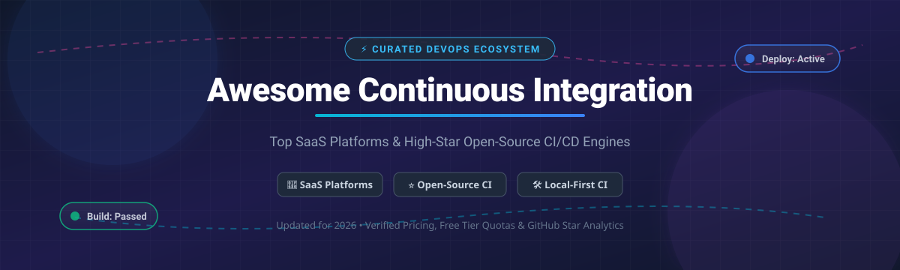

# ⚡ Awesome Continuous Integration (CI) Platform Ecosystem 🚀

  

  
  
  
  
  

---

## 📌 Overview & Market Insights 📊

Welcome to the definitive curated guide to **Continuous Integration (CI)** tools, **DevOps pipeline orchestrators**, **build automation engines**, and **local-first CI runners**. Continuous Integration automates building, testing, and validating code commits to shorten feedback cycles and improve software reliability across cloud and self-hosted infrastructure.

> 📈 **Sector Market Size & Dynamics**: The global Continuous Integration (CI/CD) tools market is estimated at **$2.1B–$2.4B in 2026** (expanding to over $13B by 2035 at a ~21% CAGR). The sector is **moderately to highly fragmented**—while cloud hyperscalers and dev platforms (GitHub Actions, GitLab) hold high adoption, no single vendor commands a winner-take-all monopoly. Enterprises actively maintain hybrid stacks combining SaaS orchestrators with open-source local runners and containerized build engines.

---

## 📑 Table of Contents 📖

- [☁️ SaaS / Managed Platforms](#-saas--managed-platforms-)
- [💻 Open-Source GitHub Projects](#-open-source-github-projects-)
  - [⚡ Local-First & Runner Utilities](#-local-first--runner-utilities)
  - [🏢 Full-Featured CI/CD Servers](#-full-featured-cicd-servers)
  - [🧩 Pipeline Engines & Workflow Automation](#-pipeline-engines--workflow-automation)
- [🤝 How to Contribute](#-how-to-contribute-)
- [❤️ Support & Sponsorship](#-support--sponsorship-)
- [📈 Star History](#-star-history-)
- [⚠️ Disclaimer](#%EF%B8%8F-disclaimer-)

---

## ☁️ SaaS / Managed Platforms 🌐

The following table summarizes commercial SaaS and managed CI platforms, sorted in descending order by **Market Valuation / Revenue / Parent Scale**:

| Product 🛠️ | Company Size / Valuation / Revenue 🏢 | Starting Pricing Tier 💰 | Free Tier / Trial Limits 🎁 | Key Features & Description 📋 |
| :--- | :--- | :--- | :--- | :--- |
| **[GitHub Actions](https://github.com/features/actions)** | **~$40B Valuation** (Parent Microsoft: ~$3.1T Market Cap; GitHub ARR: $2B+) | **$4 / user / month** (Team plan) | **2,000 mins/mo** (Free plan), **3,000 mins/mo** (Pro) for private repos + 500MB storage. Unlimited free minutes for public repos. | GitHub-native CI/CD featuring 6,000+ Marketplace Actions. Workflows run on GitHub-hosted Linux, macOS, Windows, or self-hosted runners. |
| **[GitLab CI/CD](https://about.gitlab.com/stages-devops-lifecycle/continuous-integration/)** | **~$8.0B Market Cap** (FY26 Revenue: $955M) | **$29 / user / month** (Premium plan) | **400 compute mins/mo** on free accounts (up to 50k mins/mo for qualified open-source projects). | Integrated DevSecOps platform with Auto DevOps, built-in container registry, and native pipeline visualization across Linux, macOS, and Windows. |
| **[CircleCI](https://circleci.com/)** | **~$1.7B Valuation** (ARR: ~$55M) | **$15 / month** (Performance plan, includes 30,000 credits) | **30,000 credits/mo** (~3,000 build mins on medium Linux runner) up to 5 active users. | Cloud-native CI/CD platform known for fast Docker layer caching, resource class customization, and advanced parallel test execution. |
| **[TeamCity Cloud](https://www.jetbrains.com/teamcity/)** | **Bootstrapped / Private** (Parent JetBrains Revenue: $600M+ USD) | **$45 / month** (TeamCity Cloud); On-Premises from **$299 / year** | **14-Day Free Trial** (Cloud); **100% Free On-Premises** version for up to 100 build configurations & 3 build agents. | JetBrains' powerful CI server offering intelligence build configuration reuse, flaky test detection, and deep IDE ecosystem integration. |
| **[Bitrise](https://www.bitrise.io/)** | **~$200M Valuation** (ARR: ~$20M–$30M) | **$99 / month** (Teams plan) | **Hobby Plan**: 2 free self-hosted Bitrise Runners + 500 monthly builds / 100k monthly tests on Bitrise Insights + 30-day trial. | Mobile CI/CD specialist optimized for iOS and Android builds, automated app store publishing, and physical device test matrixing. |
| **[Codefresh](https://codefresh.io/)** | **~$50M Acquisition** by Octopus Deploy (Combined ARR: $60M+) | **$99 / month** (Pay-as-you-go / Team plan) | **Community Free Plan**: 1 concurrent pipeline, up to 120 builds/mo, and free distributed caching. | Kubernetes-native and GitOps-focused CI/CD platform built on top of Argo Workflows and Argo CD. |
| **[Buildkite](https://buildkite.com/)** | **~$200M Valuation** (ARR: ~$43M) | **$15 / user / month** (Essentials plan) | **Free Personal Plan**: 1 user, 3 concurrent jobs, 90-day build history, and 500 hosted agent minutes (unlimited self-hosted agents). | Hybrid CI/CD platform combining cloud-hosted pipeline orchestration with secure self-hosted agents executing inside your own cloud or bare metal. |
| **[Travis CI](https://travis-ci.com/)** | **Acquired by Idera, Inc.** (Private Subsidiary) | **$64 / month** (Core plan, 2 concurrent jobs) | **10,000 credit single trial** (~1,000 Linux build minutes) for new accounts + free OSS credits upon application. | Early cloud CI pioneer with straightforward `.travis.yml` syntax, supporting multi-language build matrices and automated deployments. |
| **[Semaphore CI](https://semaphoreci.com/)** | **Private / Bootstrapped** (~$5M–$10M ARR) | **$20 / month** (Startup plan) | **$15 free recurring credit/mo** (~2,000 Ubuntu build mins/mo) + 20 GB egress & 100 GB storage. | High-performance CI/CD platform engineered for blazingly fast pipeline execution and automatic test parallelization. |

---

## 💻 Open-Source GitHub Projects 🔓

Curated open-source continuous integration servers, runner utilities, and containerized pipeline engines. **Sorted in descending order by GitHub Stars_Count ⭐.**

| Project 📦 | Stars_Count ⭐ | Description 📝 |
| :--- | :--- | :--- |
| **[nektos/act](https://github.com/nektos/act)** |  | **Run your GitHub Actions locally!** Uses Docker to parse `.github/workflows` and run jobs locally for immediate feedback without pushing code. |
| **[harness/gitness](https://github.com/harness/gitness)** *(Drone)* |  | **Open-source developer platform & container-native CI engine.** Next-generation continuation of **Drone CI** with YAML pipelines and Docker execution. |
| **[jenkinsci/jenkins](https://github.com/jenkinsci/jenkins)** |  | **The open-source pioneer and de facto standard CI server.** Features 1,800+ plugins for automating build, test, and deployment pipelines. |
| **[argoproj/argo-workflows](https://github.com/argoproj/argo-workflows)** |  | **Kubernetes-native workflow engine.** Orchestrates parallel jobs and complex CI/CD DAG pipelines natively inside Kubernetes clusters. |
| **[dagger/dagger](https://github.com/dagger/dagger)** |  | **Programmable CI/CD engine running pipelines in containers.** Run identical pipelines locally and on any CI provider using Go, Python, or TypeScript. |
| **[earthly/earthly](https://github.com/earthly/earthly)** |  | **Supercharged build tool for CI/CD.** Combines the best of Dockerfile and Makefile syntax to create reproducible, isolated, parallel builds. |
| **[tektoncd/pipeline](https://github.com/tektoncd/pipeline)** |  | **Cloud Native Computing Foundation (CNCF) Kubernetes-native CI/CD framework.** Standardized Custom Resource Definitions (CRDs) for building pipelines. |
| **[concourse/concourse](https://github.com/concourse/concourse)** |  | **Automation system based on resources, tasks, and jobs.** Expresses pipelines as pure mechanics with visual pipeline graphs and container isolation. |
| **[woodpecker-ci/woodpecker](https://github.com/woodpecker-ci/woodpecker)** |  | **Community-driven fork of Drone CI.** Lightweight container-native CI engine supporting GitHub, GitLab, Gitea, and Forgejo. |
| **[gocd/gocd](https://github.com/gocd/gocd)** |  | **Open-source continuous delivery server.** Renowned for Value Stream Map (VSM) visualizations and complex workflow modeling. |
| **[buildbot/buildbot](https://github.com/buildbot/buildbot)** |  | **Python-based asynchronous build automation framework.** Highly customizable framework for complex build matrices and hardware testing. |
| **[firecow/gitlab-ci-local](https://github.com/firecow/gitlab-ci-local)** |  | **Run GitLab CI pipelines locally.** Test `.gitlab-ci.yml` workflows using Docker or shell executors on your workstation. |
| **[dagu-org/dagu](https://github.com/dagu-org/dagu)** |  | **Developer-friendly cron replacement & DAG execution engine.** Minimalist task scheduler with dynamic web UI for pipeline orchestration. |
| **[agola-io/agola](https://github.com/agola-io/agola)** |  | **Redefining CI/CD.** Self-hosted pipeline engine supporting Docker and Kubernetes backends with user-level run permissions. |
| **[fluentci-io/fluentci-engine](https://github.com/fluentci-io/fluentci-engine)** |  | **Self-hosted CI/CD engine powered by Dagger and Deno.** Single-command pipeline management exportable to any major cloud CI provider. |
| **[kraken-ci/kraken](https://github.com/kraken-ci/kraken)** |  | **Modern scalable test-focused CI/CD system.** Workflows written in Starlark/Python; executors scale across bare-metal, Docker, LXD, and VMs. |
| **[huangchengsir/pipewright](https://github.com/huangchengsir/pipewright)** |  | **Single Go binary CI/CD & deployment platform.** Zero dependencies, pipeline-as-code `.pipewright.yml`, GitOps, and anomaly detection. |
| **[preloopdev/preloop](https://github.com/preloopdev/preloop)** |  | **Local microVM GitHub Actions runner.** Executes `.github/workflows` natively inside hardware-isolated microVMs with 300ms boot time. |
| **[haatos/simple-ci](https://github.com/haatos/simple-ci)** |  | **Lightweight self-hosted CI replacing Jenkins with a Go binary.** Server-side templating with HTMX and SQLite—zero Node/Docker requirement. |

---

### 🛠️ Categorized Open-Source Deep Dives

#### ⚡ Local-First & Runner Utilities
- **[nektos/act](https://github.com/nektos/act)**: Run GitHub Actions workflows locally inside Docker.
- **[firecow/gitlab-ci-local](https://github.com/firecow/gitlab-ci-local)**: Local execution engine for `.gitlab-ci.yml`.
- **[preloop](https://github.com/preloopdev/preloop)**: MicroVM runner for uncommitted local GitHub Action debugging.
- **[Fluent CI](https://github.com/fluentci-io/fluentci-engine)**: Dagger & Deno powered cross-platform local/cloud runner.
- **[SimpleCI](https://github.com/haatos/simple-ci)**: Minimalist Go + HTMX self-hosted build agent.

#### 🏢 Full-Featured CI/CD Servers
- **[Jenkins](https://github.com/jenkinsci/jenkins)**: Ecosystem pioneer with 1,800+ plugins.
- **[Gitness / Drone](https://github.com/harness/gitness)**: Container-native YAML pipeline server.
- **[Woodpecker CI](https://github.com/woodpecker-ci/woodpecker)**: Community-owned fork of Drone CI.
- **[GoCD](https://github.com/gocd/gocd)**: Enterprise Value Stream Map continuous delivery server.
- **[Kraken CI](https://github.com/kraken-ci/kraken)**: Scalable Python/Starlark test automation engine.

#### 🧩 Pipeline Engines & Workflow Automation
- **[Argo Workflows](https://github.com/argoproj/argo-workflows)**: Kubernetes-native DAG workflow orchestrator.
- **[Dagger](https://github.com/dagger/dagger)**: Programmable containerized pipeline engine.
- **[Earthly](https://github.com/earthly/earthly)**: Reproducible build automation syntax.
- **[Tekton](https://github.com/tektoncd/pipeline)**: CNCF standard CRD specifications for Kubernetes CI/CD.
- **[Concourse](https://github.com/concourse/concourse)**: Stateless resource-based pipeline engine.

---

## 🤝 How to Contribute 🛠️

Contributions are warmly welcomed! Help keep this Continuous Integration repository up-to-date and accurate:

1. 🍴 **Fork** this repository.
2. 📝 **Add or update** entries in `README.md` maintaining table formatting.
3. 🔍 Ensure descriptions are factual, concise, and include exact pricing/limits or GitHub link details.
4. 📥 **Open a Pull Request** with a brief summary of additions.

For more awesome lists, check out [Awesome Awesome Awesome](https://github.com/ishandutta2007/Awesome-Awesome-Awesome)!

---

## ❤️ Support & Sponsorship ☕

If you found this curated list helpful for evaluating CI/CD platforms or open-source build engines, please consider supporting the project:

- ⭐ **Star this repository** to help others discover it!
- 🔀 **Fork & Share** with your DevOps and platform engineering teams.
- 💖 **Sponsor the Maintainer**: Buy a coffee or sponsor ongoing maintenance on the [GitHub Sponsor Dashboard](https://github.com/sponsors/ishandutta2007).

---

## 📈 Star History 🌟

---

## ⚠️ Disclaimer 📜

- This list is **community-curated** for research, comparison, and educational purposes.
- CI/CD platforms manage sensitive source code and environment credentials—always enforce proper access controls, OIDC trust policies, and secret management.
- All product names, logos, and trademarks belong to their respective owners.
